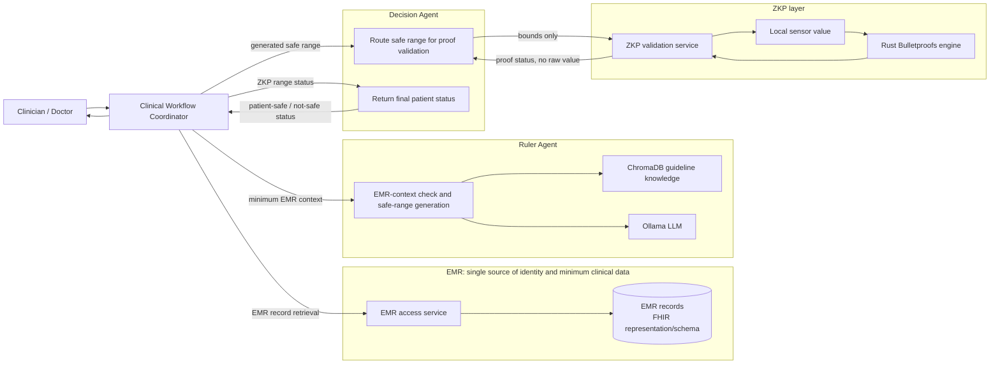

# System Architecture

The system keeps its MCP-style JSON-RPC transport (`POST /rpc`, `tools/list`,
and `tools/call`). The LangGraph coordinator remains the sole workflow
orchestrator; service roles below describe ownership, not a new protocol.

## Runtime order

1. The coordinator retrieves and checks the minimum EMR record through the single EMR access layer.
2. The Ruler Agent checks that EMR context, retrieves relevant guideline passages from ChromaDB, and uses Ollama to generate the safe clinical range.
3. The coordinator gives the generated range to the Decision Agent. The Decision Agent sends only the bounds to the ZKP layer for proof generation and validation.
4. The ZKP layer validates the range proof using the local sensor reading without exposing that reading outside its boundary.
5. The coordinator sends the proof status to the Decision Agent, which returns a patient-safe or not-safe status for the doctor.

## Compatibility and privacy boundary

- Existing JSON-RPC/MCP tool names (`get_patient`, `generate_policy`, `request_proof`, `evaluate_decision`, and `run_cdss`) remain available. `validate_safe_range` is the Decision Agent's added internal routing tool.
- Response fields remain `patient`, `policy`, `proof`, and `decision` for current Doctor Console compatibility; `patient` is the existing wire-field name for the minimum EMR context.
- The FHIR dataset is the representation/schema of the single EMR data source. It is not a separate database or architectural layer.
- The raw sensor value is used only inside the ZKP boundary. The coordinator, Ruler Agent, and final decision step receive no raw sensor value.
- `device_agent/` is an alternative local proof endpoint. The deployed flow currently invokes the Rust engine through `privacy_mcp/zkp_client.py`.
