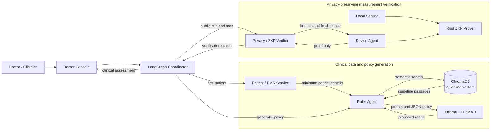
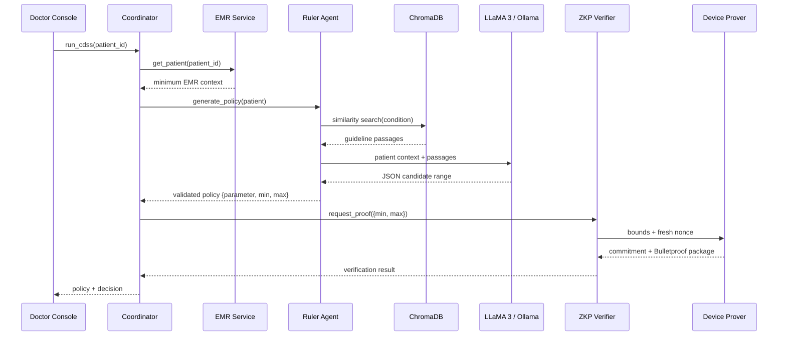

# General System Architecture

## 1. Purpose and scope

This project is a privacy-preserving clinical decision support system (CDSS).
It generates a patient-specific clinical range from minimum electronic medical
record (EMR) context and clinical guidelines, then checks a private sensor
measurement against that range without sending the raw measurement to the
server.

The system has two separate responsibilities:

1. **Clinical policy generation:** determine the public parameter and its safe
     interval, such as `systolic_bp`, `min`, and `max.
2. **Private measurement verification:** determine whether a hidden device
     measurement satisfies that interval using a zero-knowledge proof (ZKP).

The LangGraph Coordinator is the only workflow orchestrator. The other
services provide focused capabilities and do not coordinate one another.

## 2. High-level architecture

## 3. Main components

### Doctor Console

The Doctor Console is the user-facing entry point. It submits a patient case
to the Coordinator and displays the returned policy, proof result, and final
clinical status.

### LangGraph Coordinator

The Coordinator owns the end-to-end workflow:

1. Receive a patient identifier and workflow options.
2. Retrieve the minimum required EMR context.
3. Request a safe clinical range from the Ruler Agent.
4. Send only the public range to the Privacy/ZKP service.
5. Convert the proof response into a final assessment.
6. Return `patient`, `policy`, `proof`, and `decision` to the Doctor Console.

It communicates with services through MCP-style JSON-RPC requests at
`POST /rpc`.

### Patient / EMR Service

The EMR service is the single source of patient identity and minimum clinical
context. Its active tool is `get_patient`. The current dataset uses a FHIR-like
representation, but FHIR is a data representation in this project, not a
separate runtime service.

The service should return only the information required for policy generation,
for example patient age and condition. It should not be used to retrieve the
private sensor value.

### Ruler Agent

The Ruler Agent produces the public clinical policy:

1. Receive patient context from the Coordinator.
2. Read the condition and age.
3. Search ChromaDB for relevant guideline passages.
4. Build a prompt containing the patient context and retrieved passages.
5. Ask LLaMA 3 through Ollama to return a JSON safe range.
6. Extract and normalize the JSON response.
7. Validate that the bounds are numeric and that `min < max`.
8. Return the validated parameter and interval to the Coordinator.

The Ruler Agent does not read the sensor and does not perform ZKP validation.
Its output is public clinical policy, not a measurement.

### Guideline knowledge base

Guideline PDFs are loaded before runtime, split into overlapping chunks, and
embedded with Ollama's `nomic-embed-text` model. The chunks and embeddings are
stored in `knowledge_mcp/chroma_db`.

At runtime, the Ruler Agent performs a similarity search using the patient's
condition and retrieves the most relevant passages. The Knowledge MCP service
builds the vector database; the active Ruler runtime searches the database
directly.

### Ollama and LLaMA 3

Ollama hosts the language model used to generate the candidate policy. The
Ruler prompt requires JSON containing a parameter, a minimum, and a maximum.
The application still validates and normalizes the response because an LLM
response is not trusted as a typed clinical contract by itself.

### Privacy / ZKP Verifier

The Privacy service receives the public bounds and requests a device-side
proof. It does not receive the raw sensor value. Its active tools are
`request_proof` for one range and `request_proofs` for multiple ranges.

The verifier creates a fresh nonce, sends the public bounds and nonce to the
Device Agent, verifies the returned proof, and reports the verification result
to the Coordinator.

### Device Agent and Rust prover

The Device Agent reads the sensor locally. The current sensor implementation is
a simulation, but the interface represents a real patient-side device.

The Rust prover creates a Pedersen commitment and a Bulletproof range proof.
The raw value and blinding factors remain on the device. The device returns a
proof package rather than the measurement itself.

## 4. Runtime sequence

## 5. Data and trust boundaries

### Public data

The following values may cross the clinical-to-privacy boundary:

- Patient-specific policy parameter.
- Public lower and upper bounds.
- Patient identifier when needed for request correlation.
- Proof status and final assessment.

### Private data

The following values must remain on the device:

- Raw sensor measurement.
- Blinding factor used by the commitment.
- Intermediate device-side proving values.

The server learns whether the proof is accepted and therefore whether the
measurement satisfies the public interval. It does not learn the exact value.
Very narrow intervals can reduce this privacy benefit, and an alert or failed
proof still reveals a status bit.

## 6. Interfaces

All active services expose the same MCP-style JSON-RPC transport:

| Service | Port | Main tool | Responsibility |
| --- | ---: | --- | --- |
| Patient / EMR | 8005 | `get_patient` | Return minimum patient context |
| Ruler Agent | 8004 | `generate_policy` | Generate and validate safe bounds |
| Privacy / ZKP | 8003 | `request_proof`, `request_proofs` | Verify hidden measurements |
| Device Agent | 8006 | `prove` | Produce a device-side proof |
| LangGraph Coordinator | 8007 | `run_cdss` | Orchestrate the complete workflow |
| Ollama | 11434 | model API | Generate embeddings and policy candidates |

The standard request path is `Doctor Console -> Coordinator -> service`, not
service-to-service workflow orchestration.

## 7. Deployment view

The development deployment is defined in `docker-compose.yml` and includes:

- `doctor-console`
- `langgraph-coordinator`
- `patient-mcp`
- `rule-engine`
- `privacy-mcp`
- `device-agent`
- `ollama`
- PostgreSQL for EMR persistence

The Docker network is suitable for development. A real deployment should
separate the patient device from the hospital services and use authenticated
HTTPS communication. Set `DEVICE_AGENT_URL` to an HTTPS endpoint and enable
`CDSS_REQUIRE_TLS=1` when the device is deployed across hosts.

## 8. Reliability and validation rules

- Missing patient records must stop the workflow.
- Missing guideline storage or failed retrieval must be visible as a Ruler
    error.
- LLM output must be parsed and normalized before it is sent to the ZKP layer.
- Invalid bounds must be rejected; a documented fallback policy may be used
    where the implementation explicitly permits it.
- A proof failure must not be reported as a valid in-range result.
- An out-of-range alert indicates a clinical alert, not disclosure of the exact
    sensor measurement.

## 9. Current limitations and future deployment requirements

- Sensor readings are currently simulated.
- Device authentication and authenticated sensor acquisition are required for
    production use.
- The nonce provides freshness for the proof transcript but does not prove
    sensor identity or measurement time.
- Development Docker communication uses HTTP on its private network; it does
    not provide production TLS or MQTT.
- Clinical ranges generated by the LLM require clinical governance and review.
- The legacy `decision_engine/` module remains for compatibility but is not
    part of the standard Docker workflow.
