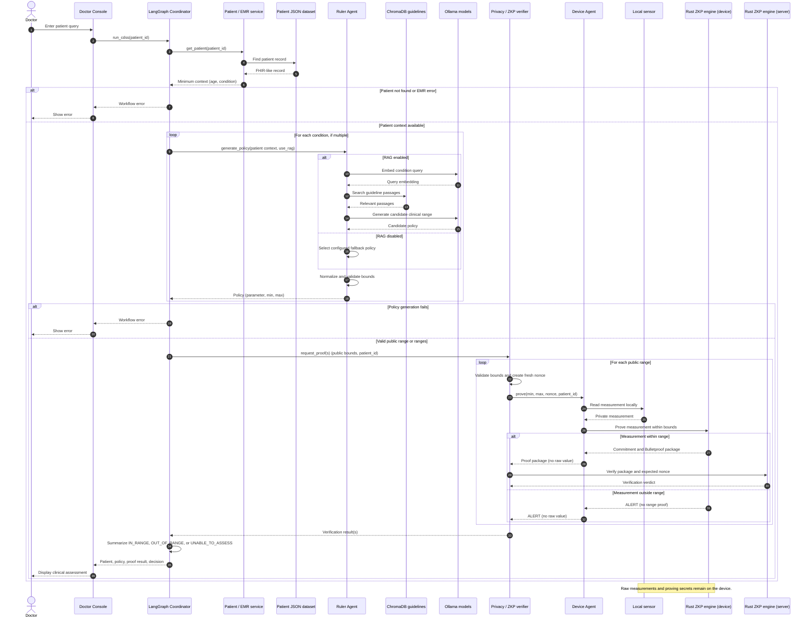

# Project sequence diagram

This diagram follows one doctor request through the active CDSS workflow. A patient with several conditions repeats policy generation and proof verification for each condition.

Guideline PDFs are embedded into ChromaDB before this runtime sequence. The current EMR lookup uses the project JSON dataset; PostgreSQL is included in the development stack but is not in this lookup path.
